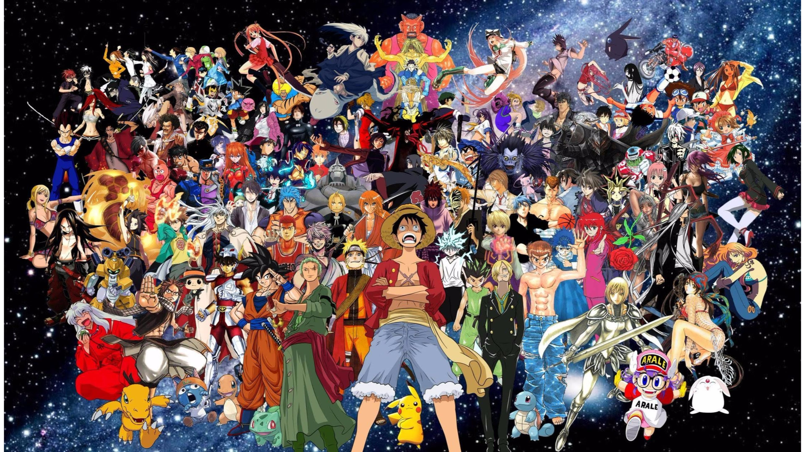

# **Anime Recommender System**

## Objective:

Creating a Recommender System using:

- [Anime Recommendation Database 2020](https://www.kaggle.com/datasets/hernan4444/anime-recommendation-database-2020)
- [SageMaker's built-in Factorization Machines algorithm](https://docs.aws.amazon.com/sagemaker/latest/dg/fact-machines.html)

### About FM:

It's a Collaborative filtering algorithm.\
Learns dense embeddings for *both* users and items, and then predicts interactions based on the *dot product* of these learned factors.

It's a latent factor model / matrix factorization approach. Captures more complex patterns in the data and handles *sparse* datasets.