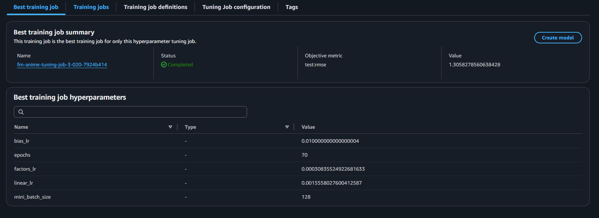

## Training Jobs


### Hyperparameter tuning


Setting up the hyperparameters could be difficult. SageMaker offers Hyperparameter training jobs where we can look up for the the best training job. In this project we'll be using the hyperparameters suggested from this service.\
The training job configurations can be found in `src/jupyter-space/tuning_job_cfg.json`

Feel free to explore more of these, as well as the value *ranges*. My best training job had an **RMSE** of about $1.3$



Make sure that the RecordIO files are uploaded to your S3 bucket in order to create the data channels.

<hr>


### Training job

After tuning you can Create the model and the corresponding Endpoint directly from the console. However if you want to interactively train, use:
```bash
ars-job train --config <path-to-cfg>
```

The configuration YAML file is under: `src/config/aws-uris.yaml`.

View your AWS URIs and training configuration using:
```bash
python src/config/aws_uris_view.py
```

It uses the **omegaconf** library under the hood which interpolates using custom resolvers.


### Deploying